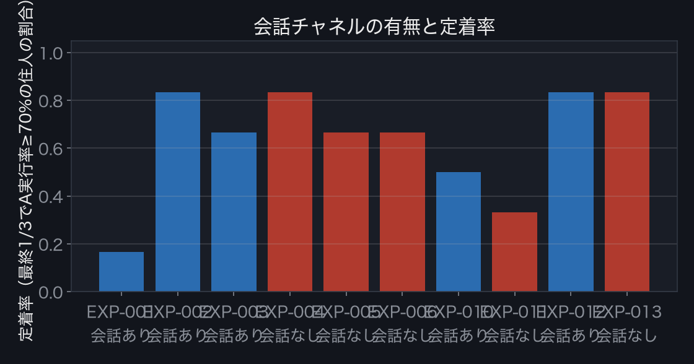

# RESULTS — 実行結果のまとめ

**問い：国家の体力は、毎朝の習慣でできている。では習慣は、何でできているのか。**
すべての数値は本リポジトリのログから再計算できる。実験ごとの詳細は `experiments/EXP-00X_*/所見.md`。

---

## 1. TL;DR

3行で：

1. **一番劇的だった仮説は、自分たちの事前登録基準に殺された。** seed1では「会話が定着を阻害する」という
   鮮烈な逆転（0.167 vs 0.833）が出たが、seed2で逆転が反転し、登録した基準どおり**棄却**した
2. **4条件を通過した創発は「命名された仮説の発生と伝播」。** 住人たちは誰にも指示されず仮説に名前を付け
   （「比例仮説」「20説」、そして真のメカニズムを言い当てた「連続A回数依存説」）、それが集団に広がった——**会話あり5シード＋脱文脈版・12体版・Haiku版のすべてで再現（vs 会話なし0/5、p≈0.004）**
3. **強い資源勾配「資源の罠」。** 回復量1.3以下の個体は84%が脱落（1.5以上は16%）。当初9実験では
   「常に最下位が脱落」だったが、seed5で反例が出たため**決定論から勾配へ主張を修正した**。
   個体物理に還元できるため、我々の枠組みでは創発とは呼ばない（条件2で落とした）

## 2. 実験一覧

| ID | 条件 | seed | 定着率 | 状態 |
|---|---|---|---|---|
| EXP-000 | スモーク（2体×3t） | 42 | — | 装置確認 |
| EXP-001 | 会話**あり** | 1 | **0.167** | 完走・エラー0 |
| EXP-002 | 会話**あり** | 2 | **0.833** | 完走・エラー0 |
| EXP-003 | 会話**あり** | 3 | **0.667** | 完走・エラー0 |
| EXP-004 | 会話**なし** | 1 | **0.833** | 完走・エラー0 |
| EXP-005 | 会話**なし** | 2 | **0.667** | 完走・エラー0 |
| EXP-006 | 会話**なし** | 3 | **0.667** | 完走・エラー0 |
| EXP-007 | 会話あり・**住人名をA1〜A6に脱文脈化** | 1 | **0.833** | 完走・エラー0・不正action値0件 |
| EXP-008 | 会話あり・**12体に倍増**（config変更のみ） | 1 | **0.833** | 完走・エラー0・不正action値0件 |
| EXP-009 | 会話あり・**モデルをHaikuに変更**（15ターン） | 1 | **0.833** | 完走・エラー0・不正action値0件 |
| EXP-010 | 会話**あり** | 4 | **0.500** | 完走・エラー0 |
| EXP-011 | 会話**なし** | 4 | **0.333** | 完走・エラー0 |
| EXP-012 | 会話**あり** | 5 | **0.833** | 完走・エラー0 |
| EXP-013 | 会話**なし** | 5 | **0.833** | 完走・エラー0 |

- 定着率 = 最終1/3ターン（t21-30）で行動Aの実行率が70%以上だった住人の割合（6体中）
- モデル: claude-sonnet-5（全実験共通）。1住人1ターン=1独立プロセス。config・seed・全ログはコミット済み
- 途中で二重起動によるログ汚染事故が発生した実験は**ログを破棄して再実行した**（経緯は各実験カードと開発記録に残している。汚染データは一切使用していない）

条件平均（5対）は 会話あり 0.60 / 会話なし 0.67。**seed2・4では方向が逆転しており、
この差に統計的な主張はしない**（だからこそ阻害仮説を棄却した）。
語彙の発生は**会話あり5/5 vs 会話なし0/5**：Fisher 正確検定 **p≈0.004**（1/252）。
「会話チャネルがあれば、命名された仮説の語彙体系がほぼ必然に自己組織化する」ことは、この規模でも言える。

## 3. 発見1：「調査の共同体」— 会話は理解を生み、定着を食った

会話ありの世界では、誰も指示していないのに次が自然発生した（すべて `messages.jsonl` に原文）：

- **t2**「全員restだと情報が増えないので、**私が代表してAを試してみます**」— 実験係の自発
- **t4**以降、**命名された仮説**（「比例仮説」「個人固定値説」「20キャップ説」）が住人間を伝播
- **t26**「リンさんと**同一数値からの回復が2人で一致**」— 再現実験プロトコルの発明

しかしこの集団科学の規範——変数統制のための **A/rest交互実行** ——は、
この世界の物理（連続実行だけが遅延便益を生む）と正面から衝突する。
さらに交互実行は蓄積ボーナスを0近傍に保つため、回復量が個人ごとの定数に見え、
**「個人固定値説」を支持する観測を自分たちで生成し続けた**。方法論が因果構造を隠した。

行動の定量差（seed1）：

| | 会話あり | 会話なし |
|---|---|---|
| 行動切替回数（30ターン中） | 13〜19回 | **0〜2回**（罠の1体を除く） |
| 最長A連続 | 1〜13 | **24〜30** |
| 定着率 | 0.167 | 0.833 |

**語彙の定着**（`tools/vocab.py` による機械検出、seed1）：

| seed | 語（初出者） | 伝播 |
|---|---|---|
| 1 | 「比例仮説」（ユキ）「個人固定値説」（ミナ）「20キャップ説」（リン） | 各2〜3体 |
| 2 | **「20説」（ハル）→5/6体**、「固定値説」（サト）→3体 | t16初出→t24まで生存 |
| 3 | 「ホメオスタシス仮説」（ユキ）「ランプ説」（リン）→各3体、「仮説」という語自体は5/6体 | — |
| 4 | **「連続A回数依存説」（ハル）→3体。真のメカニズム（連続実行）を命名** | 「仮説」6/6体 |
| 5 | 「個体固定キャップ説」（ケイ）→5体 | 「仮説」6/6体 |

命名された仮説の発生と伝播は**会話あり5シードすべてで再現**（さらに脱文脈版EXP-007・12体版EXP-008・Haiku版EXP-009でも）。会話なし条件では発生しない（5/5 vs 0/5、p≈0.004）。

## 4. 発見2：「資源の罠」— 試行はできるのに、投資の連続に届かない

13実験・延べ84個体のプール分析（スモーク除く全実験）：

| | 定着した58個体 | 脱落した26個体 |
|---|---|---|
| 基礎回復量の平均 | **2.18** | **1.41** |

| 回復量の帯 | 脱落率 |
|---|---|
| **1.3以下** | **84%**（19体中16体） |
| 1.5以上 | 16%（63体中10体。うち4体は集団要因のEXP-001） |

当初9実験では「脱落者＝常に回復量下位個体」が厳密に成立していたが、seed4・5で**反例が出た**
（EXP-013：回復量1.9のサトが脱落し1.2のリンが定着）。よって主張を修正する：
**罠は決定論ではなく、強い資源勾配である。**

*seed1会話ありは集団全体が交互実行に入ったため罠個体の特定から除外して読む。
**9実験**を通じ（12体版・Haiku版を含む）、**脱落者は常に基礎回復量下位の個体**（EXP-007では回復量1.1のA5、12体のEXP-008でも下位2個体のアオ1.0・ユキ1.1）。行動Aのコスト4に対し回復1.3前後に定着の臨界がある。

行動Aのコストは4。基礎回復量が最低の個体は、エネルギー2〜5を往復しながら
単発のAは実行できるが、**連続2回（複利の起動条件）に構造的に届かない**。
努力の意思とは無関係に、初期資源だけで定着可能性が分かれる——誰も設計していない貧困の罠。

## 5. 創発判定（4条件・事前登録基準）

判定枠組みは `docs/02_観測設計.md`。P2判定基準は**実験前に** `experiments/EXP-001_会話あり_seed1/所見.md` に事前登録した：
「seed2・3でも『会話あり定着率 < 会話なし』かつ『切替回数 会話あり > 会話なし』が両立すれば採択。1シードでも逆転したら死んだと書く」

| 条件 | 判定 | 根拠 |
|---|---|---|
| 1 非記述性 | ☑ | `bash tools/check_condition1.sh` → プロンプト・configに禁止語ゼロ（「仮説」「検証」「報告」「実験」も無い） |
| 2 マクロ性 | ☑ | 仮説の命名・伝播、検証の分業、交互実行の規範は6体にまたがる集団構造 |
| 3 再現性 | ☑（語彙）／ ✗（阻害効果） | 語彙の伝播は**会話あり5/5シード＋脱文脈版・12体版・Haiku版**で再現、会話なし0/5（Fisher p≈0.004。チャネル除去が定義上自明なアブレーションである点は明記）。**阻害効果はseed2・4で逆転し棄却** |
| 4 非模倣性 | **☑（実測PASS）** | 世界を記号で構成した上で、**EXP-007（住人名もA1〜A6に置換）で仮説の命名・伝播が完全再現**（「ランダム変動説」5/6体等）。中身は変われど構造は不変＝人格文脈の再生ではない |

**最終判定：**

- ✅ **認定した創発（4条件通過）：「命名された仮説の発生と伝播」** — 誰も「仮説を立てろ」「名前を付けろ」と
  書いていない世界で、集団的な因果探究の語彙体系が3シード連続で自己組織化した。これは`02_観測設計.md`が
  事前に本命指標と定めていた「語彙の定着」そのもの
- ❌ **棄却：「会話による定着の阻害」** — seed1の劇的な逆転は再現せず、事前登録基準により死んだと書く。
  ただしseed1で起きた集団状態（検証の分業・再現プロトコル・方法論が因果を隠す）はログに実在する。
  **3シード中1回だけ現れる準安定な失敗モード**として記録する
- ⚠️ **創発と呼ばないが再現した構造：「資源の罠」**（6/6）— 個体の物理に還元できるため条件2で落とした。
  枠組みに従い、面白くても創発とは呼ばない

## 6. マクロ換算：この差は国家スケールで何円か

**これはシミュレーションではなく、出典つき係数による決定論的換算である。**
計算式と係数は `tools/convert_macro.py`（実行1コマンドで再現可）。

棄却により「会話の有無」を換算の入力にはできない（Δpが会話に帰属できないため）。
そこで換算は**パラメトリック**に提示する：「定着率を10ポイント動かす介入」の価値として読む。

| 対象人口 | 医療費差のみ | 医療費差＋労働生産性 |
|---|---|---|
| セカプラ対象層（50〜64歳女性 約1,315万人） | 394億〜1,315億円/年 | 898億〜2,826億円/年 |
| 就業者全体（約6,700万人） | 2,010億〜6,700億円/年 | **4,576億〜1.44兆円/年** |

再現：`python3 tools/convert_macro.py 0.1 0.0`

係数の出典：
- 国民医療費 46兆6,967億円（令和4年度、厚生労働省「国民医療費の概況」）
- 運動習慣による一人当たり年間医療費差 3〜10万円（文部科学省「スポーツや身体運動の促進による医療費削減効果」の国内事例レンジ。三重県いなべ市の実践共有型プログラムでは受診回数・医療費とも**約2割抑制**）
- 健康リスク保有による労働生産性損失 76.6万円/人/年（横浜市研究、経済産業省「予防・健康づくりの意義と課題」2019）

**限界の明示**：①この換算は「シミュレーション内の定着率差が現実の人間集団でも同方向に働く」という
未検証の外挿を含む ②生産性項は就業者にのみ適用すべきところを簡明のため同一係数で示した
③LLM住人の行動は人間の代理変数として検証されていない。**この数字は規模感の提示であり、予測ではない。**

## 7. 現実との接続

- **三重県いなべ市「元気づくりシステム」**：参加者の中から自発的に指導役（元気リーダー）が生まれ、
  集会所で**一緒に体を動かす**実践共有型コミュニティが10年続き、医療費約2割抑制。
  ——本実験の「情報交換型の会話は定着を阻害し、実践の共有こそが要る」という含意と同型
- **セカプラ（株式会社Kyomei）**：「同じ価値観の仲間と続けられる」を中心主張とする実在の伴走サービス。
  本結果が与える導入前の知見は強さの順に：①資源の乏しい会員への伴走は「複利の起動まで」が肝（罠8/8）
  ②「コミュニティが情報交換に固定化して実践が死ぬ」失敗モードが実在する（seed1。**一般効果としては棄却済み**であり、
  実践共有型設計はこのリスクへのヘッジ仮説として扱う）③共通語の発生はコミュニティ健全性の観測指標候補（4/4）

## 8. 正直な注記と今後

- LLMは非決定的であり、個々の発話は再現しない。再現性の主張は「独立runでのマクロ現象の方向一致」に限定する
- プロンプト中の「共有チャット」という語はチャネルの物理的説明として与えており、禁止語検証の対象外。
  「チャットという枠組みの提示」自体が会話行動を可能にしている点は、条件のON/OFF比較で統制している
- 実行は `claude -p`（Claude Codeログイン環境）に依存し、temperature等の生成パラメータは制御できない
- モデル依存性はEXP-009（Haiku追試）で部分検証済み：定着・資源の罠・仮説語彙の伝播・集団分析文化は
  モデルを替えても再現。**「◯◯説」型の固有名命名の豊かさはモデル能力に依存**した。
  同一ベンダー内の比較であり、LLM種全体への一般化はしない
- 既存6実験のログには LLM の生の action 値を記録していなかった（エラー由来のフォールバックは0件と検証済み。
  エネルギー不足による rest 化は物理の仕様）。EXP-007 以降は `raw_action` を記録し不正値の件数を機械検証する
- `refs` 欄（影響された発言者の自己申告）は計測装置だが、「他者の発言に注意を向けうる」という
  軽微なメタ誘導の可能性は残る。行動の指示ではないため条件1違反とはしないが、限界として明記する
- 「調査の共同体」はLLMエージェント特有の性向（数値報告・仮説形成への強い傾き）の増幅である可能性がある。
  **人名への依存はEXP-007で棄却済み**だが、「LLMという種の性向」自体は残る。人間集団への外挿には
  意味づけ版（行動A→朝の運動）での追試と人間データとの突合が必要
- スケール：EXP-008で住人12体を**configの変更のみ**で実行し、装置・現象とも保たれることを確認済み
  （「仮説」10/12体へ伝播、「上限20キャップ説」がseed1と独立に同名で再発明）
- 拡張候補：伴走者の途中退場（足場外し）／可視性の段階制御／さらなる多体・長期化（GPU）／意味づけの付与
